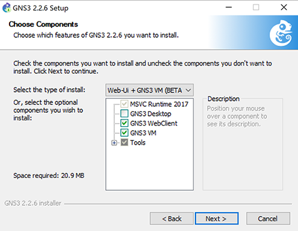
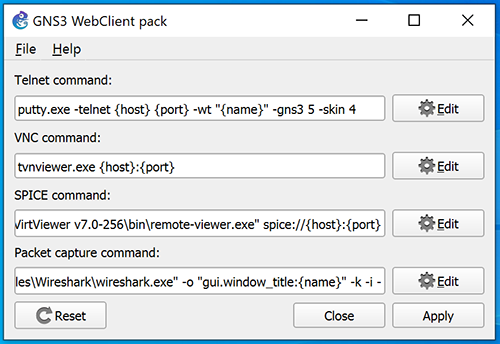
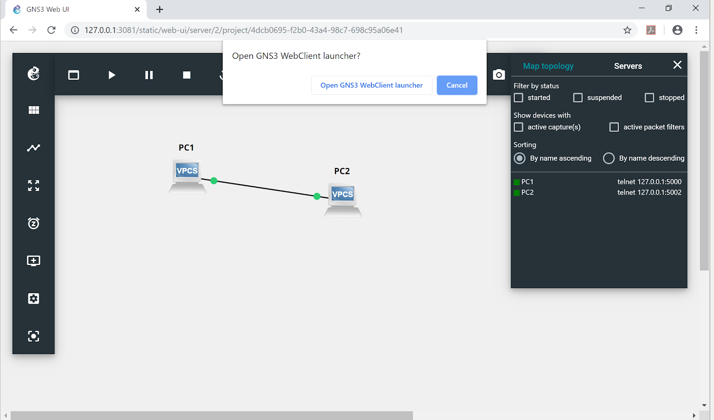
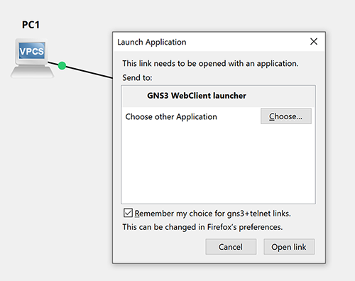

A web client pack must be installed on your operating system in order to launch local applications needed to work with the GNS3 Web interface. We currently support Telnet, VNC, SPICE and packet capture applications.

Please remember to run the GNS3 Web interface with Chrome or Firefox. Also, please note the Web client is currently in Beta version and still needs some polishing. For example packet capture will not work with a GNS3 server that requires authentication (this will be fixed in a future release).

Additionally, we have plans for an HTML5 console support so native consoles won’t be required.

### Installation on Windows
Make sure the GNS3 WebClient option is ticked when installing GNS3 then follow the installation process. Protocol handlers are registered during the installation.

### Installation on macOS

1. Download the [WebClient pack from here](https://github.com/GNS3/gns3-webclient-pack/releases/download/v1.0.0b2/GNS3.WebClient.pack-1.0.0b2.dmg)
2. Drag and drop the app from the DMG into /Applications. Start the app at least once to register the protocol handlers.

### Installation on Linux

Please [read this document to install on Linux](https://github.com/GNS3/gns3-webclient-pack/blob/master/README.md) (via PPA, PyPi or manually). Use the “gns3-webclient-config” command to start from a terminal.

### Usage

The WebClient has 2 executables. The webclient configurator to edit settings like the console software paths and the webclient launcher that actually launches applications based on the clicked URL in the GNS3 web interface. Different protocol handlers are registered to open the webclient launcher during the WebClient installation.

The first step is to configure your application paths or leave by default.

Then launch the Web Ui, start a node, right click on it and select “console”. Alternatively, just right click on a link and select “Start capture” to start a packet capture and start Wireshark.

Choose “Open GNS3 WebClient launcher” to start your application when using Google Chrome web browser.

On Firefox web browser, select the GNS3 WebClient launcher and tick “Remember my choice for gns3+telnet links” then click on “Open link”. You won’t have to do this again the next time.

