:::note
VMware ESXi and VMware workstation are two totally different products. If you want instructions for VMware Workstation or VMware Fusion [read this document](../getting-started/setup-gns3-vm).
:::

GNS3 provides a GNS3 VM for ESXi. It has Ubuntu preinstalled with GNS3 and preconfigured.  GNS3 will not control your ESXi and by default ESXi limit what GNS3 can do, you will need to configure ESXi in order to properly run the GNS3 VM.3 VM.

:::note
Before using GNS3 on ESXi you need to know how to use it locally.
:::

## ESXi Version

This documentation cover only ESXi 6.5 using the web interface. The GNS3 VM is known to work with ESXi 5.5 and 6.0 but configuration interface will be different. The vSphere UI is also not explained here.

:::note
VMware fixed the bug related to GNS3 after the official release of 6.5 so make sure to apply all updates. Especially you need to have the last web interface installed: https://labs.vmware.com/flings/esxi-embedded-host-client/
:::

## Download the GNS3 VM

Read this documentation for download links. https://docs.gns3.com/1Bn-s1Izkjp13HxcPF4b8QSGfkWJYG_dpMt9U1DQjvZ4/index.html CHECKLINK

:::note
Be careful to download the ESXi version for VMware and not the Workstation or VirtualBox version.
:::

## Import the VM

### Create the VM
Open the web interface and create a new VM:

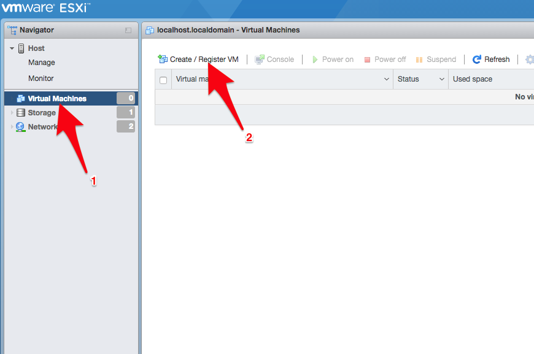

Choose ”Deploy a virtual machine from an OVF or OVA file”


 Enter the name and upload the .ova of the GNS3 or if your OS unzip the OVA when extract the zip all the files:

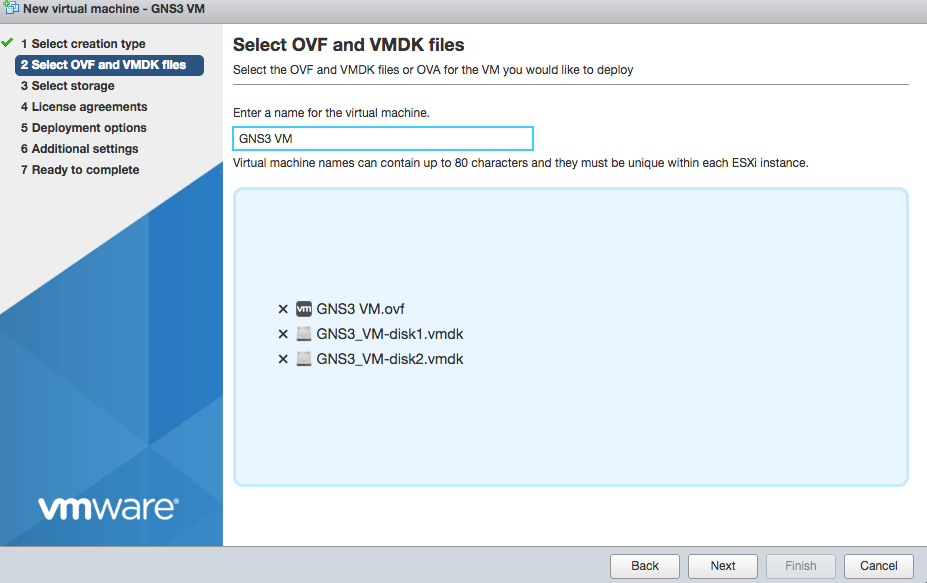

Select the datastore of your choice and continue.

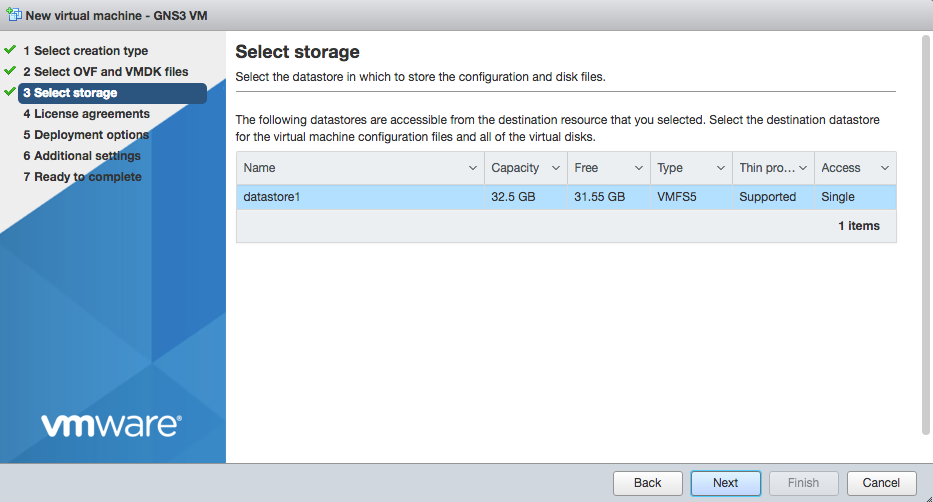

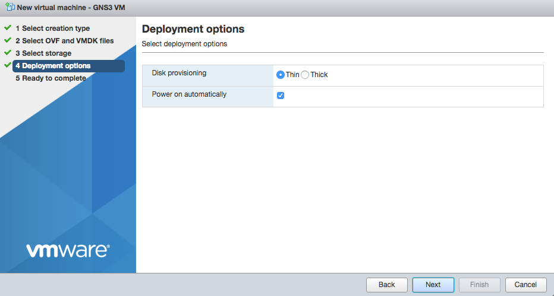

At the end of wizard wait for disk upload:


### Nested virtualization
After booting the VM you will see that KVM is not available:

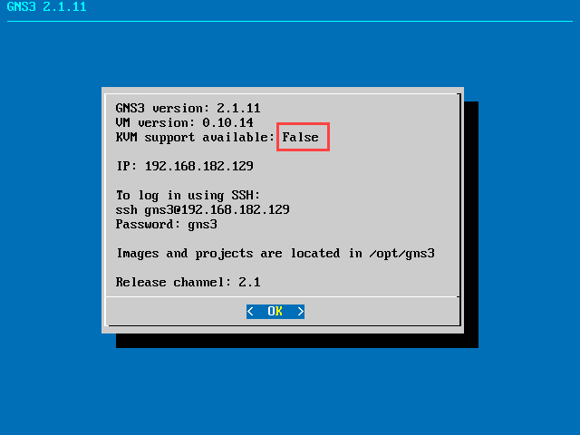

This prevent fast Qemu VM; in order to solve that we need to allow the nested virtualization.

Stop the VM and edit the settings. You need to check expose hardware assisted virtualization:

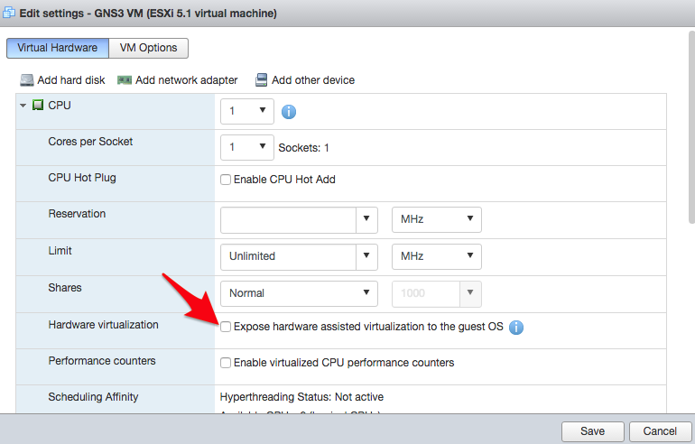

**Previous Version of ESXi**
If you want do expose nested version on previous version. You need to edit the .vmx file and change the settings inside:

```
hypervisor.cpuid.v0 = "FALSE"
vhv.enable= "TRUE"
```

### Cloud node support

By default VMware for security reason will block forged packets, which means the cloud will not work. To fix that create a new port group:

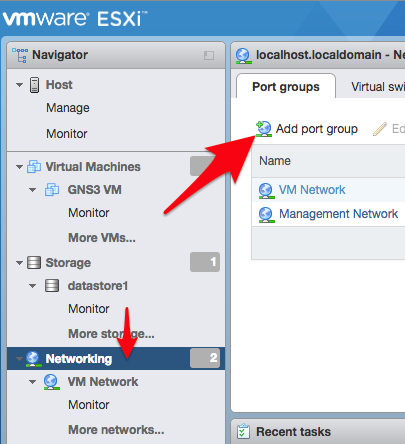

And accept everything:

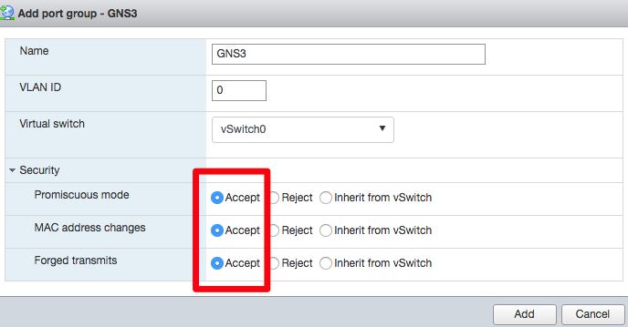

Edit the VM settings to use the new network:

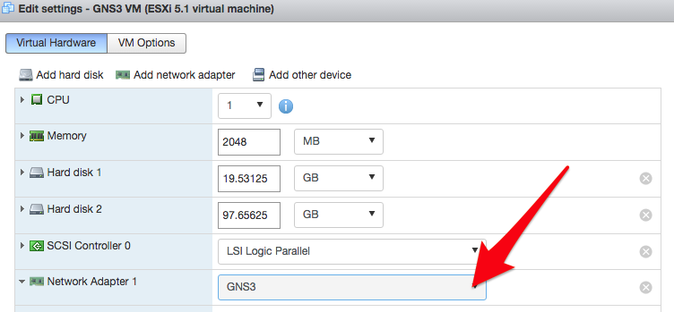

### Security
GNS3 has no auth enabled by default. It’s your duty to restrict access to it at the network level. Remember that someone controlling GNS3 could inject traffic in your network and run any VM of his choice.

## Add the VM in GNS3

Since GNS3 2.0 you have two way for adding the VM in GNS3.

### Use it as a central server
With this method you can share a  GNS3 instance with multiple clients. All the settings, images, projects will be stored on the GNS3 VM in ESXi. It’s the common way to deploy GNS3 for multiple users.

Read documentation [here](https://docs.gns3.com/1K_OVfincey0cUw6CP4dWVgs_pBXMdIJ6gdFGjNy8EZQ/index.html)CHECKLINK.

### Additional compute process for my local server

If you want to keep data local and run some workload on your computer you can use it as remote compute node. First add the node in the remote server:

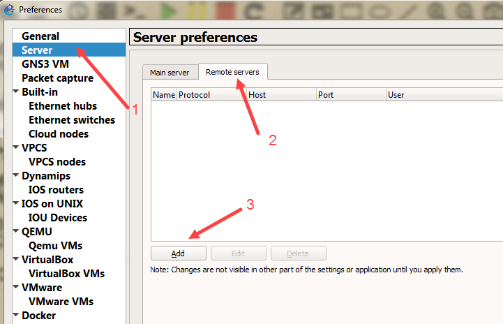

Apply the settings. After that you need to alias the GNS3 VM as your remote server.

:::note
Why alias the remote server as the GNS3 VM? This allow portability, if you move the project to another computer the GNS3 VM alias could be to an instance of VMware Workstation, Virtualbox or a Cloud server
:::

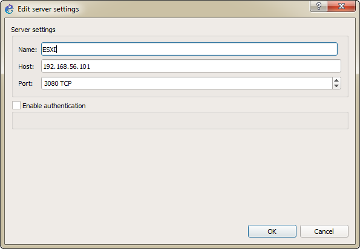
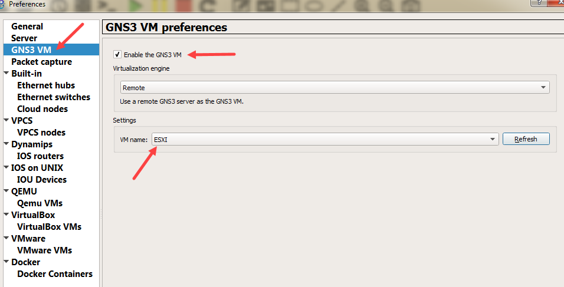

### Access to the GNS3 VM via internet

:::caution
Do not expose the GNS3 VM directly on the internet or via port redirection. It will not work. The correct and secure way is to use a VPN.
:::
