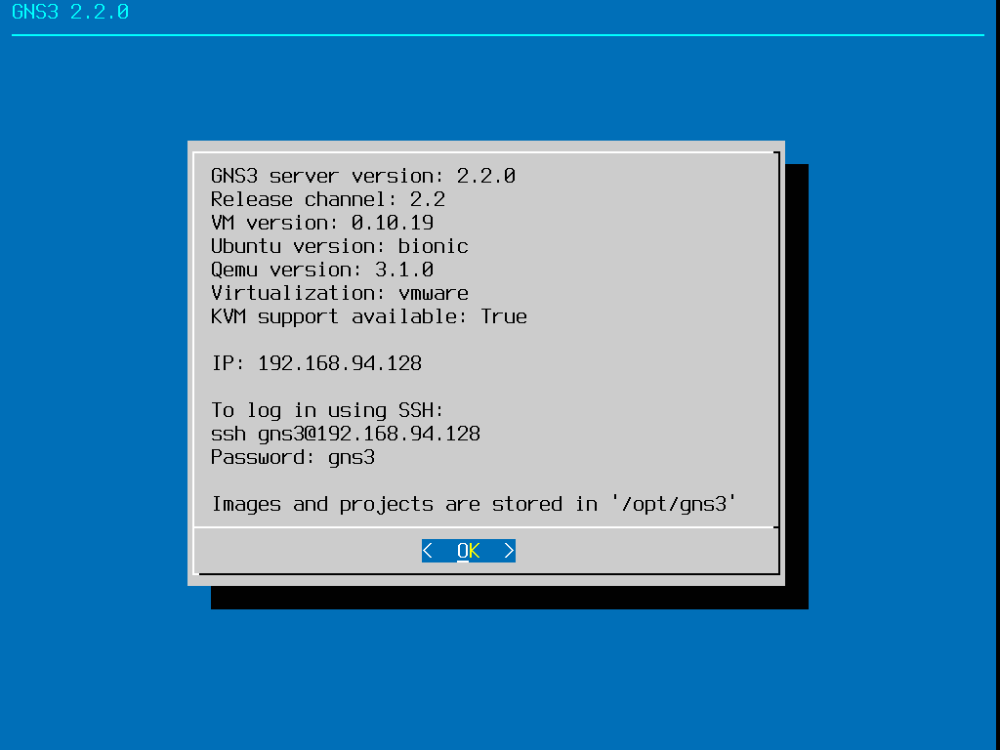
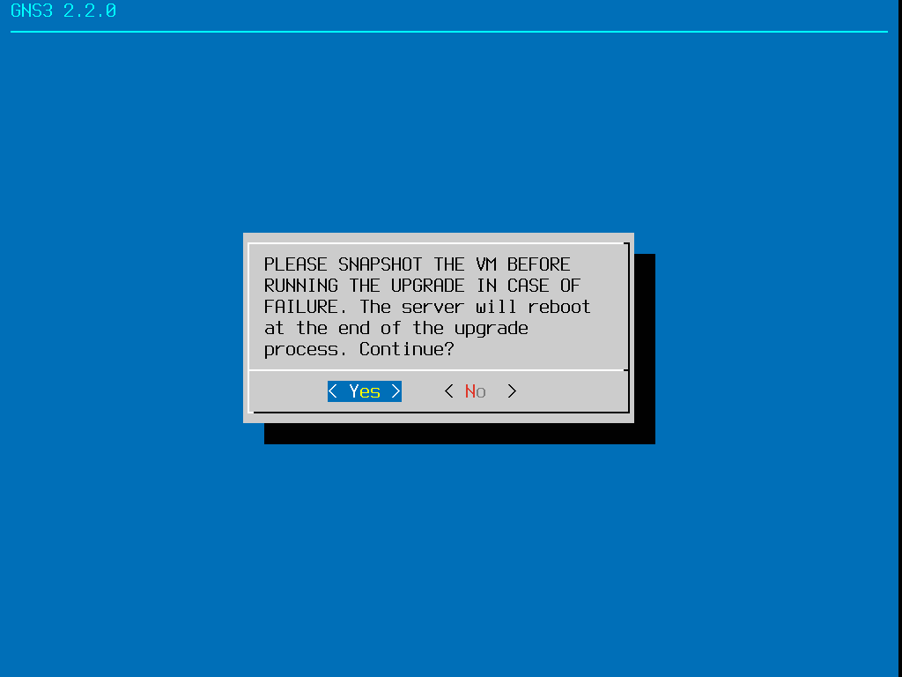
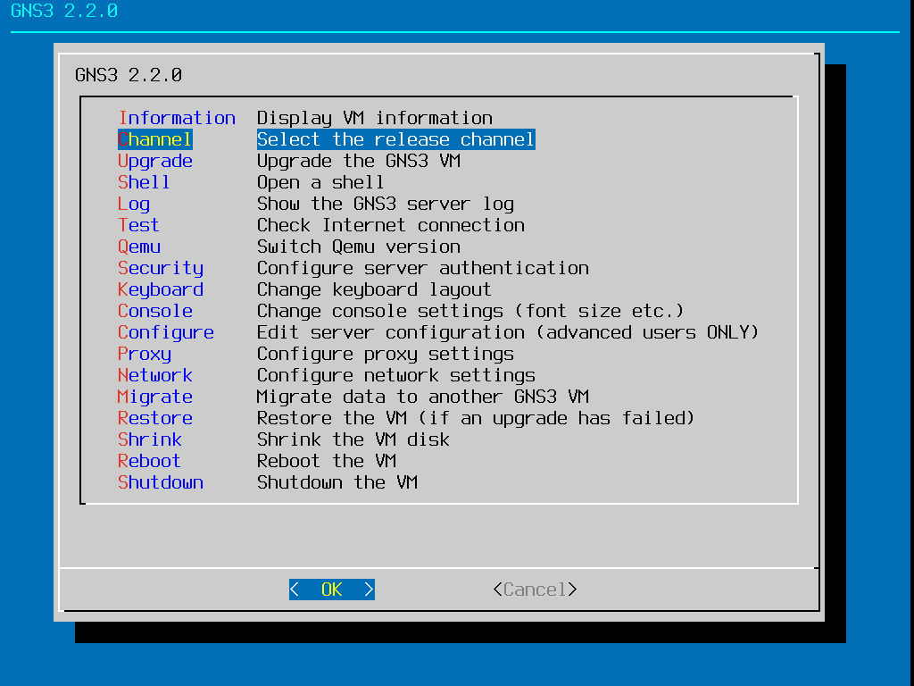
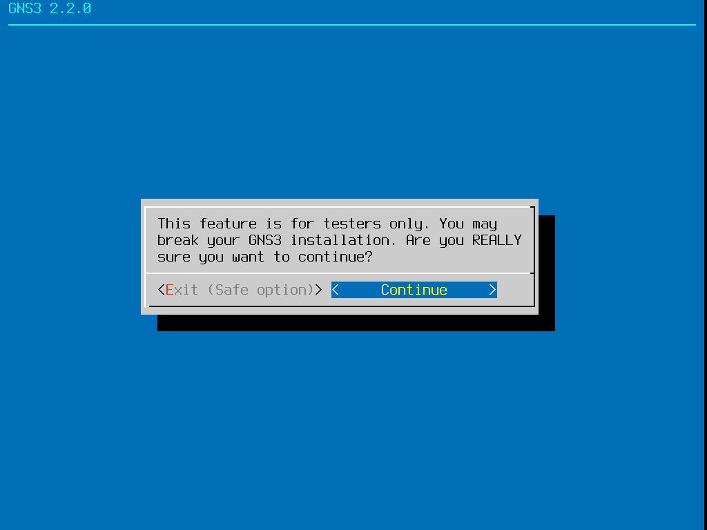
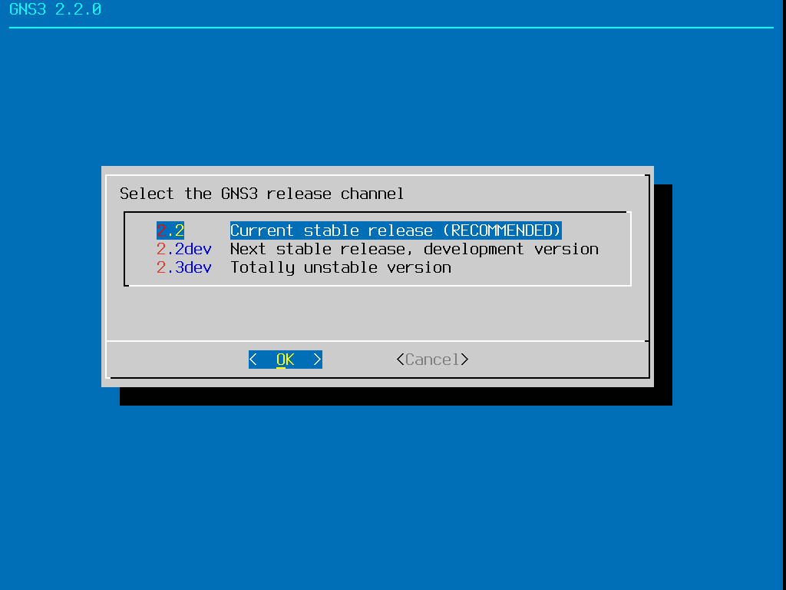
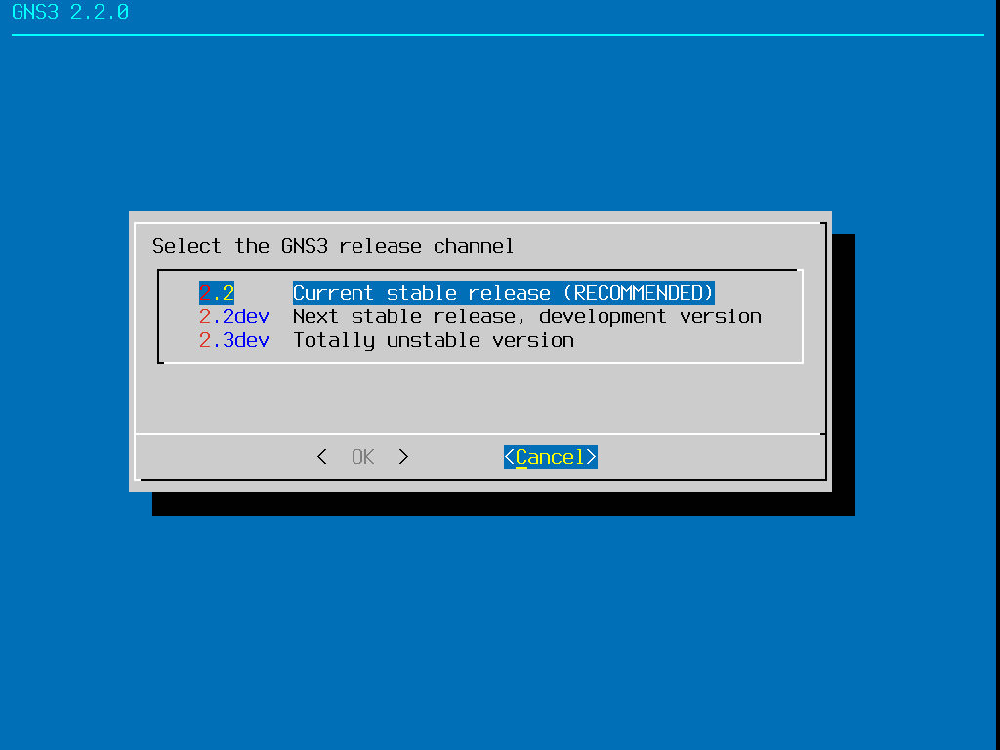
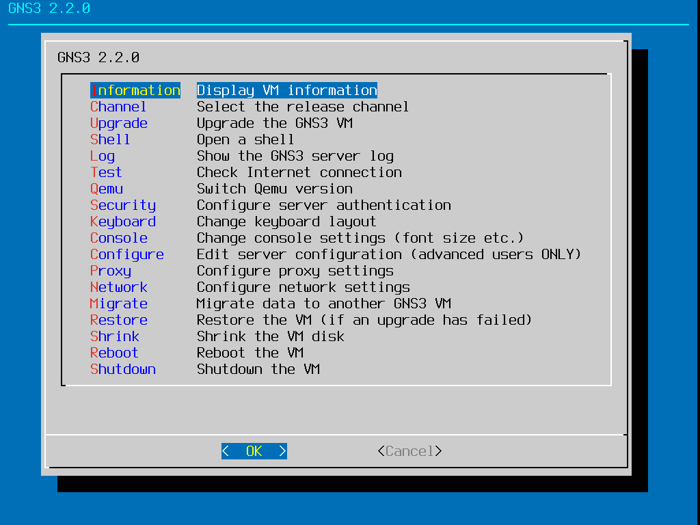

## Upgrading the GNS3 Client

:::note
Backup your topologies before upgrading.
:::

### Windows / MacOS
Just install the new version on top of the previous installation.

### Linux packages
If you are using Linux packages just upgrade GNS3 via your system package upgrade.

## Upgrading the GNS3 VM

Your GNS3 VM version need to be the same version as the GNS3 client.

:::caution
You will find methods on the internet about using the pip command. Do not use it for the GNS3 VM, this will upgrade GNS3 but not the dependencies.
:::

:::note
Before upgrading it we recommend that you snapshot your GNS3 VM  in your virtualization software (VMware or VirtualBox). In case of issue this will allow you to rollback.
:::

In order to upgrade, press the **Enter** key at the GNS3 VM **Information** screen (**OK** is the only option on that screen):

Press the **Down arrow key** to highlight **Upgrade**, and press **Enter**:

You'll be presented with a warning to take a snapshot of the GNS3 VM, in case something goes awry during the upgrade process, as it can break your existing GNS3 VM. This option is highly recommended before proceeding!

To continue with the upgrade process, ensure **Yes** is highlighted, and press **Enter**:

As mentioned in the above screenshot, the GNS3 VM will reboot at the end of this process.
You can also change the version branch in use by your GNS3 VM.  Use the arrow keys to highlight **Channel**, and press **Enter**:

You will be presented with a warning that this option is only for testers. If you do wish to proceed, ensure **Continue** is highlighted, and press **Enter**:

You will next be presented with a listing of the available release channels. It’s highly recommended to stick with the **Stable** release channel!

If you still wish to change the release channel, use the arrow keys to select the release channel you want to use, and press **Enter**. (the **OK** option is already selected):

To safely back out of this screen, press the **Tab** key, use the arrow keys to select **Cancel**, and press **Enter**:

This return you back to the main GNS3 VM menu, without changing the release channel:

