## Introduction

This document explains how to connect GNS3 topologies to the Internet when using a local GNS3 server.

:::note
Use of the NAT node to allow topology nodes to access the internet is also an option. It is simpler than using the Cloud node, but devices on your LAN and the Internet will not be able to access them directly. Instructions on using the NAT node are covered here.
:::

The topology created in this document looks as follows:

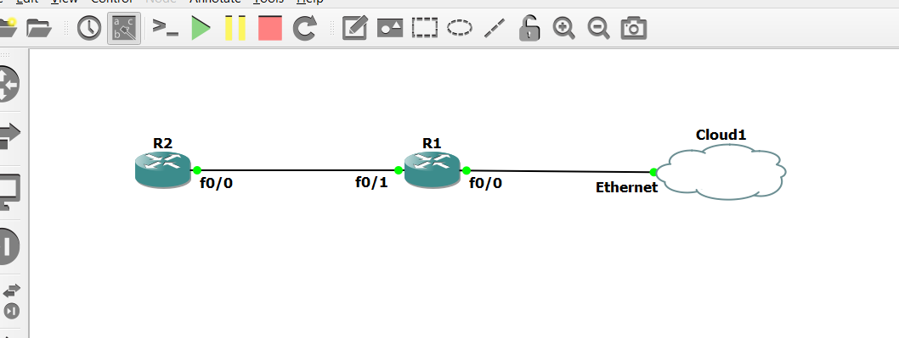

:::caution
Ensure that your PC firewall is not blocking GNS3 traffic. If necessary, turn off your PC’s firewall.
:::

## Local Install
The following steps show you how to connect a local GNS3 installation to the Internet. In this document a simple topology of two Cisco routers are used to demonstrate:

- Adding a cloud to the GNS3 topology
- Configuring IP addressing
- Configuring DNS resolution
- Configuring NAT on the Cisco router
- Advertising Routes in OSPF
- Testing

1. To create a new GNS3 topology, select a group of devices in the **Devices Toolbar** by clicking the **Browse Routers** button

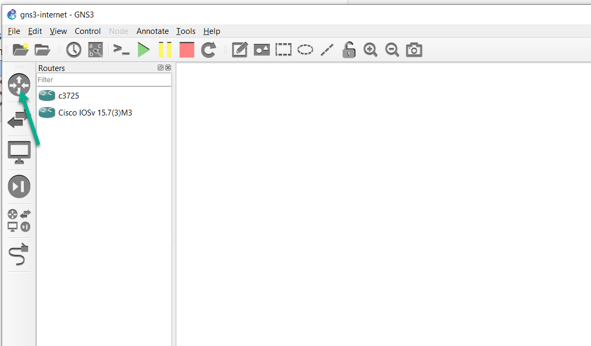

2. The routers available will depend on your GNS3 configuration. In this example both a local router and GNS3 VM router are available.


3. Drag and drop a **local** router to the GNS3 **Workspace**. An instance of the node becomes available in the **Workspace**:

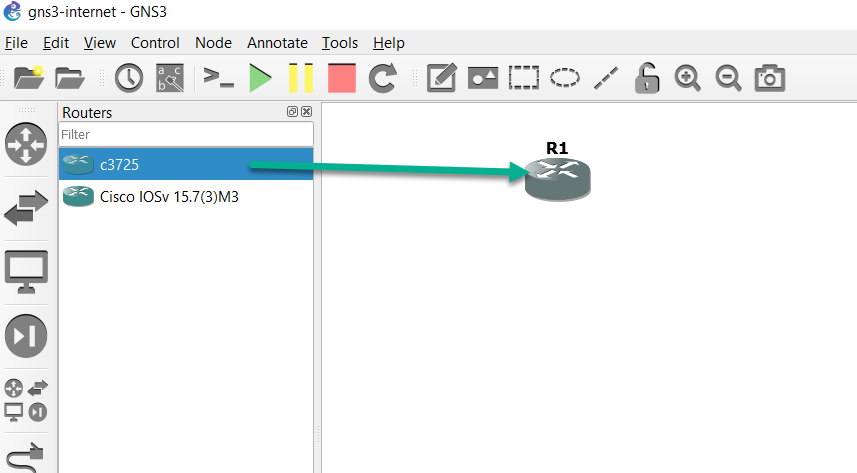

4. Drag and drop another **local server** router to the GNS3 **Workspace**:

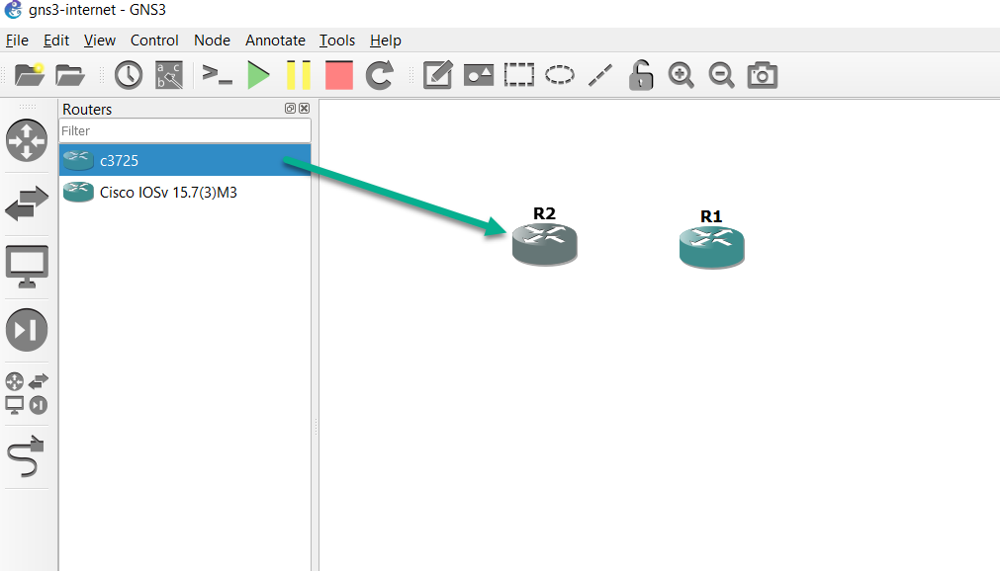

5. Click the **End devices** button:

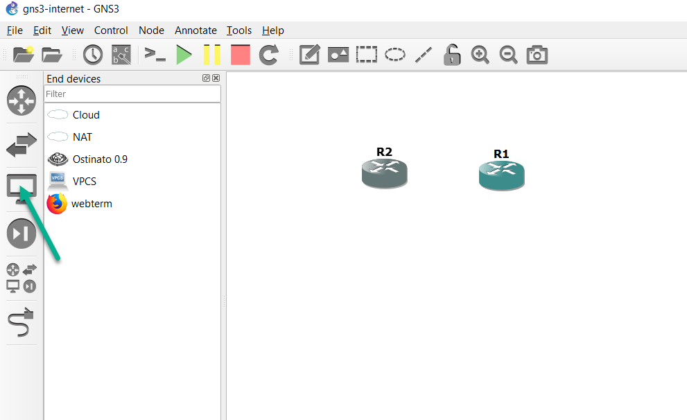

6. Drag and drop a **Cloud** node to the **Workspace**, select a **local server**, and then click **OK**:

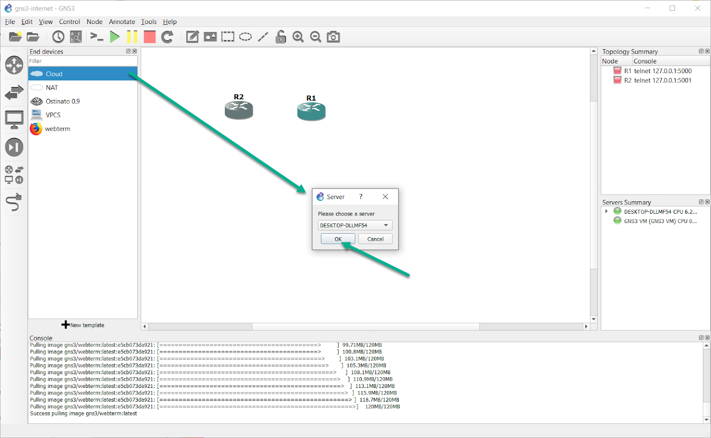

7. The **Cloud** node will now appear in the **Workspace**:

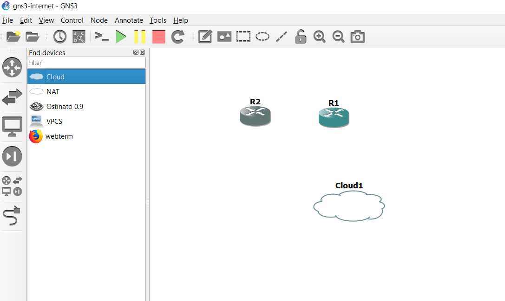

8. Click the **Toolbar Device** button again to collapse the group:

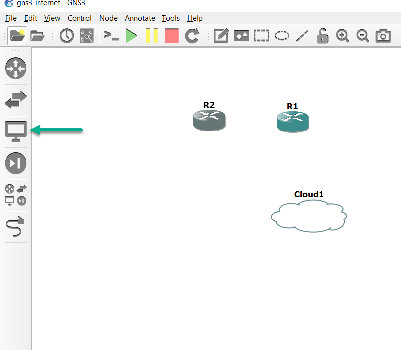

9. Right click on the **Cloud** and then click **Configure**:

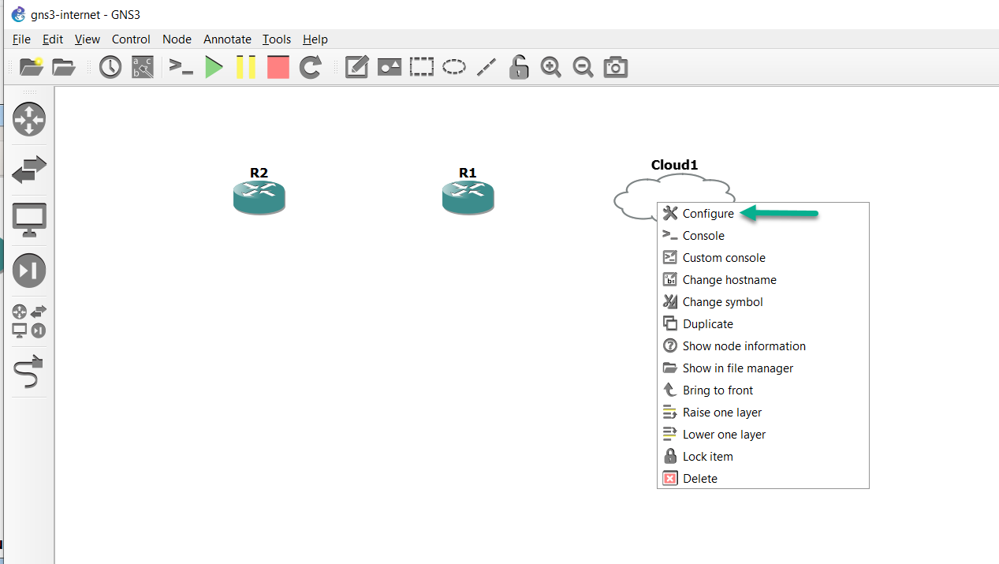

10. A list of available Ethernet interfaces is listed:

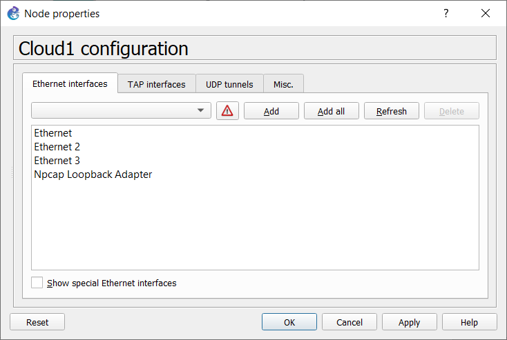

Use of physical interfaces is recommended. However, it is possible to use other interfaces, like a bridge interface, or a wireless interface. Configuring those is outside the scope of this article.

Below are examples of enabling “show special ethernet interfaces”, and then viewing the dropdown list:

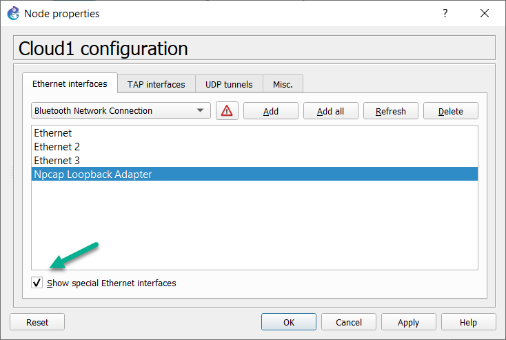
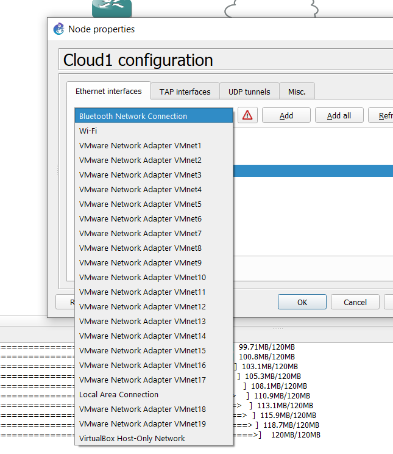

11. Click the **Add a Link** button to start adding links to your topology. The mouse cursor will change to indicate that links can be added:

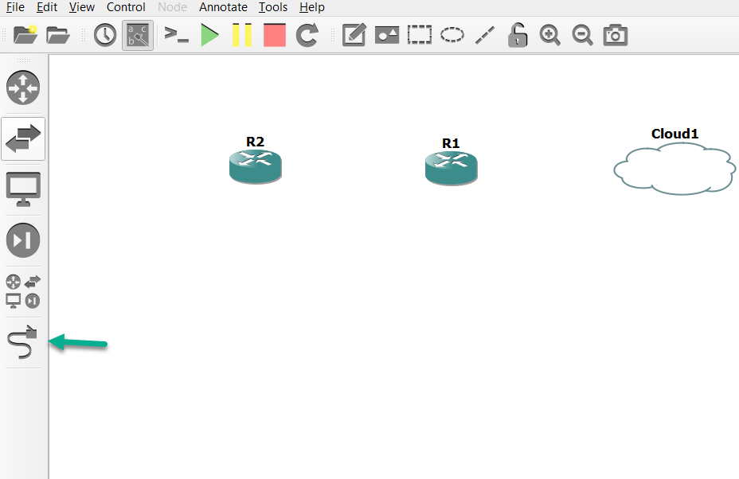

12. Click on the first router topology to display available interfaces (this is device dependant):

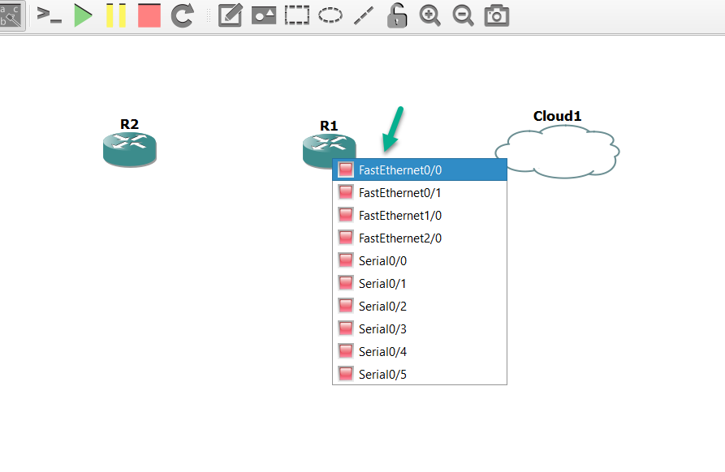

13. Click the interface and then select the cloud in the topology to connect the interface to it. In this example FastEthernet 0/0 on R1 was selected. Next, click on the Cloud node, to see a list of available interfaces:


(notice that the listed interfaces on the Cloud node matches what we saw in its properties)

14. Select an interface on the **Cloud** to complete the connection. In this example,  **Ethernet** on **Cloud 1** was selected:

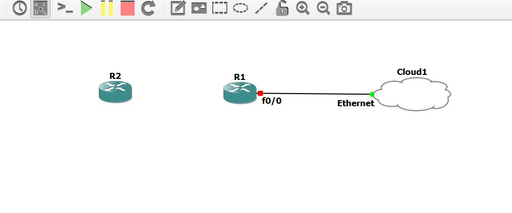

15. Add another link between R2 and R1:

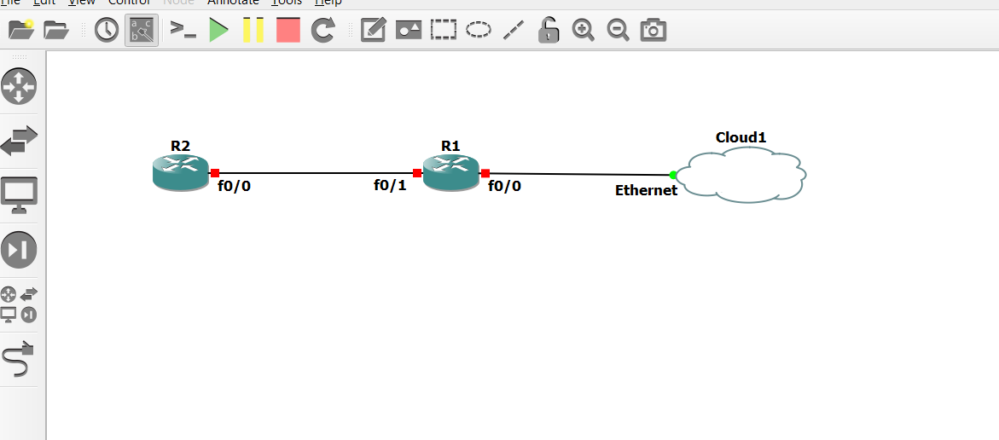

16. Click the **Add a Link** button to stop adding links. The mouse cursor will change back to normal to indicate that you have stopped adding links:

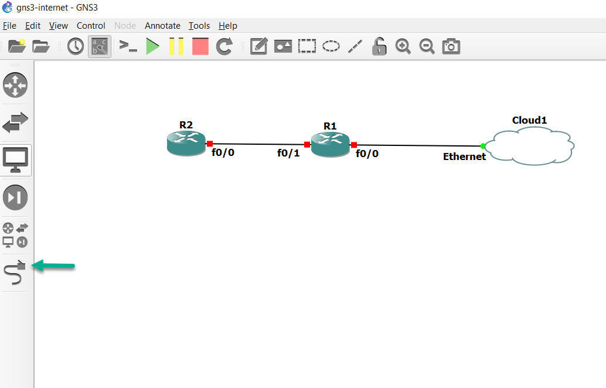

17. If not already done, click the **Show/Hide interface labels** button on the **GNS3 Toolbar** to display interface labels in your topology:


18. You are now ready to power on your network devices. Click the Start/Resume button on the GNS3 Toolbar to start up your network devices:

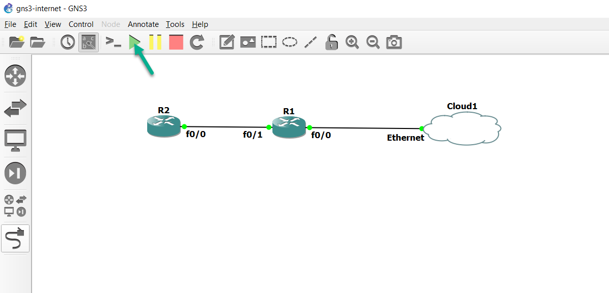

19. You are now ready to configure your devices. Click the **Console connect to all devices** button on the **Toolbar** to open a connection to every device in the topology:

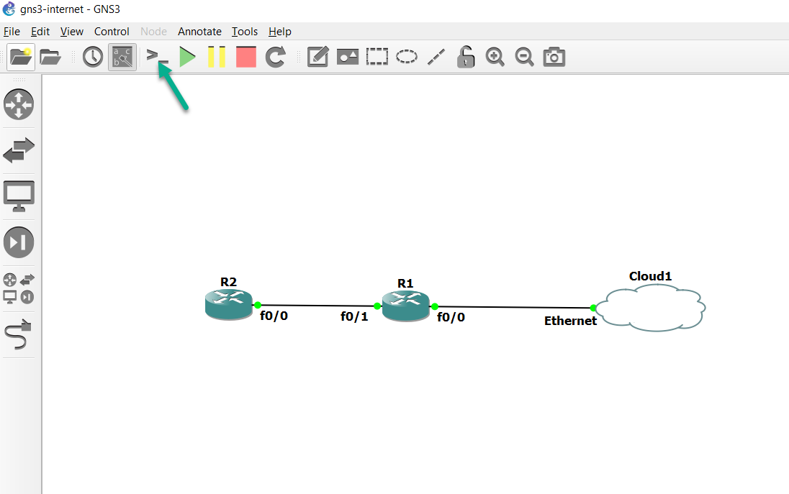

20. A console connection is opened to each router in the topology:

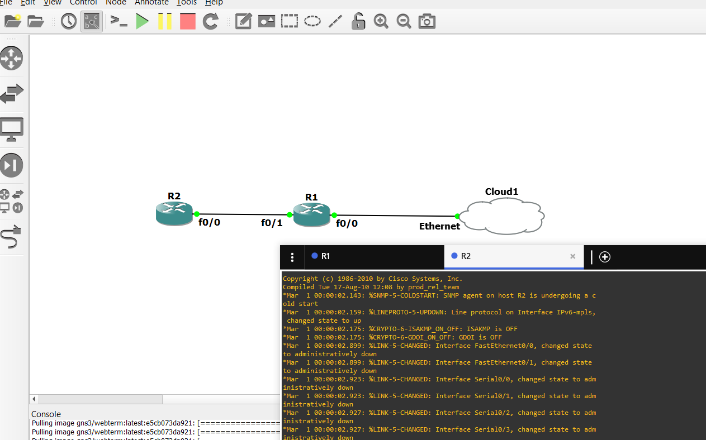

21. Configure IP addresses:

**Option 1: DHCP**
If using DHCP, configure R1 as follows:

```
R1# configure terminal
R1(config)# interface FastEthernet 0/0
R1(config-if)# ip address dhcp
R1(config-if)# no shutdown
R1(config-if)# end
R1#
```
Result: An IP address is allocated to the router by the DHCP server:

```
R1#
*Mar  1 00:03:14.831: %DHCP-6-ADDRESS_ASSIGN: Interface FastEthernet0/0 assigned DHCP address 192.168.1.29, mask 255.255.255.0, hostname R1
```

**Option 2: Manual configuration**
If configuring static IP address, configure R1 with an IP address in the same subnet as your local PC:

```
R1# configure terminal
R1(config)# interface FastEthernet 0/0
R1(config-if)# ip address 192.168.1.123 255.255.255.0
R1(config-if)# no shutdown
R1(config-if)# exit
```

Configure a default gateway:

```
R1(config)# ip route 0.0.0.0 0.0.0.0 192.168.1.249
R1(config)# end
```

22. Ping the router’s default gateway:

```
R1# ping 192.168.1.249

Type escape sequence to abort.
Sending 5, 100-byte ICMP Echos to 192.168.1.249, timeout is 2 seconds:
.!!!!
Success rate is 80 percent (4/5), round-trip min/avg/max = 8/17/36 ms
R1#
```

**Result** Pings should succeed.

23. Ensure that the router is configured to use the correct DNS server:

```
R1# configure terminal

R1(config)# ip domain-lookup
R1(config)# ip name-server 8.8.8.8
R1(config)# end
R1#
```

24. Ping google.com:

```
R1# ping google.com


Translating "google.com"...domain server (8.8.8.8) [OK]

Type escape sequence to abort.
Sending 5, 100-byte ICMP Echos to 216.58.198.174, timeout is 2 seconds:
!!!!!
Success rate is 100 percent (5/5), round-trip min/avg/max = 12/19/24 ms
R1#
```

**Result** Pings succeed.

If your pings don’t succeed, ensure that you have connectivity to your default gateway and ensure that the default gateway is configured for NAT to translate the address allocated to the GNS3 router.

25. Configure IP addressing on the Internal GNS3 network:


Configuration on the routers:

```
R1 R1# configure terminal

R1(config)# interface FastEthernet 0/1
R1(config-if)# ip address 10.1.1.1 255.255.255.0
R1(config-if)# no shutdown
R1(config-if)# exit
R1(config)#
```

```
R2R2# configure terminal
R2(config)# interface FastEthernet 0/0
R2(config-if)# ip address 10.1.1.2 255.255.255.0
R2(config-if)# no shutdown
R2(config-if)# exit
R2(config)#
```

26. Configure OSPF on R1 and R2 and advertise a default route:

```
R1R1(config)# router ospf 1
R1(config-router)# network 10.0.0.0 0.255.255.255 area 0
R1(config-router)# default-information originate
R1(config-router)# end
R1#

R2R2(config)# router ospf 1
R2(config-router)# network 10.0.0.0 0.255.255.255 area 0
R2(config-router)# end
R2#

Result OSPF neighbor relationships are established:

R1*Mar  1 00:19:24.431: %OSPF-5-ADJCHG: Process 1, Nbr 10.1.1.2 on FastEthernet0/1 from LOADING to FULL, Loading Done
R1#

R2*Mar  1 00:19:24.467: %OSPF-5-ADJCHG: Process 1, Nbr 192.168.1.123 on FastEthernet0/0 from LOADING to FULL, Loading Done
R2#
```

:::note
If the OSPF relationships are not formed, check your configuration. Make sure you have configured IP addresses correctly, enabled the interfaces and cabled the GNS3 network correctly.
:::

27. Configure DNS settings on R2:

```
R2# configure terminal

R2(config)# ip domain-lookup
R2(config)# ip name-server 8.8.8.8
R2(config)# end
R2#
```

28. R2 will not be able to ping Internet devices until you configure NAT on R1 (or enable routing between R1 and your Internet gateway). In this example, the Internet gateway does not support routing, so NAT will be configured on R1:
R1# configure terminal

```
R1# configure terminal
R1(config)# interface FastEthernet 0/0
R1(config-if)# ip nat outside
R1(config-if)# interface FastEthernet 0/1
R1(config-if)# ip nat inside
R1(config)# ip nat inside source list 1 interface FastEthernet 0/0 overload
R1(config)# access-list 1 permit 10.0.0.0 0.255.255.255
R1(config)# end
R1# write memory
```

29. Test R2 connectivity to the Internet:

```
R2# ping google.com

Translating "google.com"...domain server (8.8.8.8) [OK]

Type escape sequence to abort.
Sending 5, 100-byte ICMP Echos to 74.125.140.138, timeout is 2 seconds:
.!!!!
Success rate is 80 percent (4/5), round-trip min/avg/max = 36/40/44 ms
R2# write memory
```

Result R2 is able to ping devices on the Internet.

30. **Congratulations!** You have configure Internet connectivity from GNS3.
