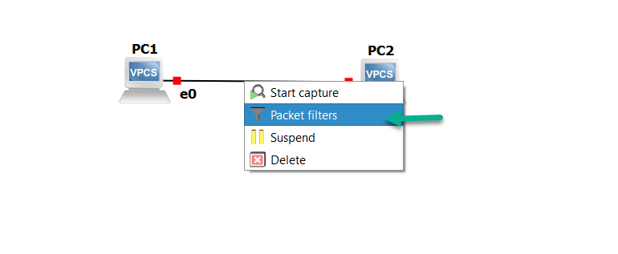
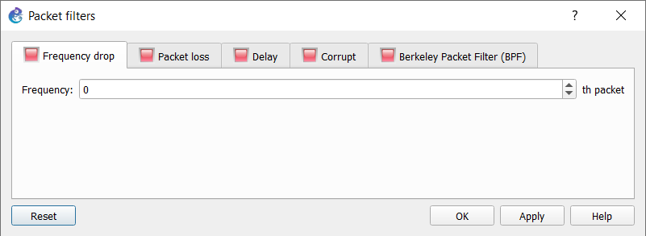
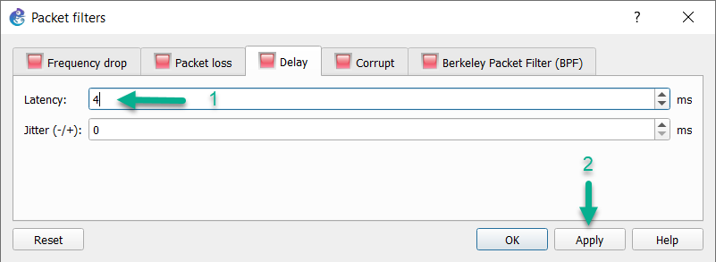
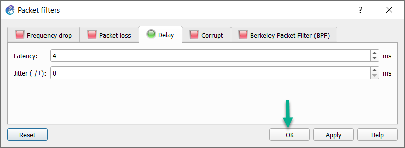
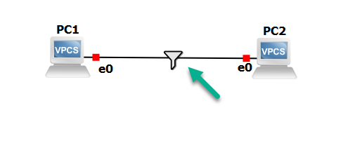
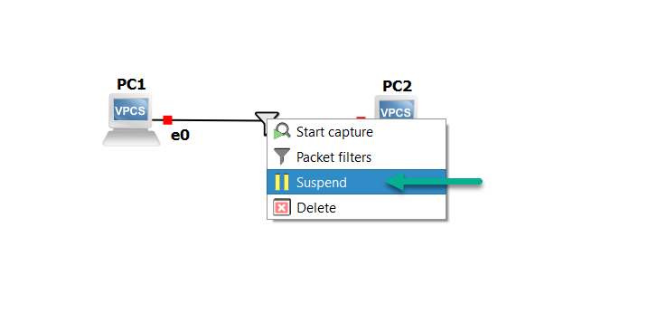
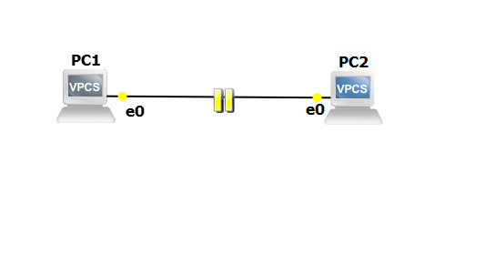

:::note
available in GNS3 version 2.1 and later.
:::

## Packet Filters

Packet filters can be applied on links without stopping any node.

Supported packet filters are:
- **Frequency_drop** drop a packet every x packets.
- **Packet_loss** randomly drop a packet
- **Delay**:  adds latency and/or jitter.
- **Packet_corruption** randomly corrupt a packet.
- **BPF_(Berkeley_Packet_Filter)** filter packets matching a BPF expression.

All packet filters can be combined, meaning you can apply both a packet loss filter and a delay filter on the same link that will be active simultaneously.

To apply a packet filter, right-click on a link, and select **Packet filters**:

As an example, click the **Delay** tab, add a non-zero value for **Latency**, then click **Apply**:

The icon on the **Delay** tab changes from a red square to a green circle, indicating it’s active:

Click **OK** to close the **Packet filters** window:

A filter icon will be displayed on the link to indicate one or more packet filters are active.

## Suspend a Link

It is possible to suspend a link.  For instance, to simulate a temporary connectivity issue in your project. Suspending a link currently means that all packets going through the link will be dropped.

To suspend a link, right-click it and then select **Suspend**:

The link is now suspended, so no traffic can pass through it:

