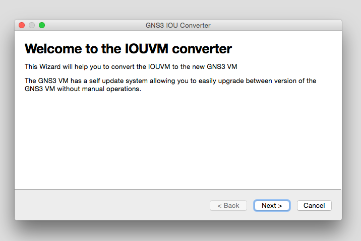

Starting with GNS3 v1.4,  the IOUVM was deprecated in favor of the GNS3 VM.

:::note
This conversion tool is available only for GNS3 1.X you can’t use it in 2.0 and later. If you want to convert a 1.3 installation with IOUVM to 2.0,  you need to might to version 1.5, first, then to 2.0.  
:::

## Why a new VM?

The original VM was a hack made by the community and after maintain by the GNS3 team. But this vm has several issues:
- OS was stripped down, without any way to properly reinstall missing packages
- No script allowing users to rebuild the VM from scratch
- Blocked on a specific Debian version with old packages
- Old Python version 3.3,  with annoying bugs in the GNS3 context
- Supports *only* IOU
- Upgrade path is unnecessarily painful
- Only VirtualBox was supported

The new GNS3 VM is:
- One click upgrade
- Supports IOU, dynamips, qemu docker, and futures solutions
- Easy to build a new VM for everyone
- Easier to use
- Correctly supports Virtualbox, VMWare, Hyper-V, and KVM
- Nat and Host-only interface support

You have no easy way for using GNS3 1.4 in the IOUVM. The easier solution is to move to the new GNS3 VM. Trying to get GNS3 1.4 running on the IOUVM will probably require you days of work for fixing the broken OS dependencies.

## But I will lose my projects!
No we provide tools for upgrading. We recommend to backup your .gns3 project files before the upgrade.

## How much time is required for the upgrade
No more than 5 minutes.

## How to Upgrade
### Step 1 Download the GNS3 VM

Go to http://www.gns3.com and download the lastest  VM for VirtualBox or VMware.

### Step 2 Launch the wizard

Launch GNS3 and in the tools menu launch IOU VM Converter

### Step 3 Follow the wizard

After cliking on the IOUVM converter button you will see a wizard helping you to move from the IOUVM to the GNS3 VM. Just follow the instructions on screen carefully.

