## Introduction

One common misconception about GNS3 is that GNS3 does not support advanced switching options. While this was true in the past, GNS3 now supports options such as:
- Etherchannel
- PVST+
- RPVST+
- MST
- Port Security
- DTP
- And many others.

Complimentary campus technologies such as HSRP are also supported.
Your selection of image and platform will affect what is possible. Options include:
- Cisco IOSvL2
- Etherswitch module
- IOU
- GNS3 built in switch
- Openvswitch
- Others

## Cisco Switches

### IOSvL2

**Recommended_switching_platform** Cisco VIRL IOSvL2

With a Cisco VIRL IOSvL2 image, you can configure and test a wide range of advanced switching features. Go here for a full list:

https://learningnetwork.cisco.com/docs/DOC-30404

This is the official Cisco way of emulating a switch.

### Etherswitch

**Basic_switching** Etherswitch module

While an Etherswitch module does not support advanced layer 2 features, it does allow you to configure basic VLANs, Spanning Tree and other options.

:::note
Instructions on configuring a c3725 router to act as an “etherswitch router” (or “swouter”), with a few basic instructions are found at the bottom of this document
:::

### IOU

IOU is a less resource intensive alternative to IOSvL2, but the images are not publicly available. You will need to get them from someone who works at Cisco. In addition, as this is a Cisco internal tool, IOU mages may be buggy and no support is available.

## Non-Cisco

### Unmanaged switching: GNS3 built in switch
Use this if all you need is a basic switch to connect devices in a GNS3 topology. You cannot configure this switch through a CLI, but you can set the number of ports supported on the switch and other basic settings.

:::note
It’s not running a switch OS, everything is emulated from scratch. This mean some protocol could be buggy. Use it only for basic operations
:::

### Open vSwitch
By leveraging GNS3 support for Docker, you can now add Open vSwitch to your GNS3 topologies. In order to do that, use this template:

https://gns3.com/marketplace/appliance/open-vswitch

### Others
You can also use switches from other vendors such as Cumulus, Extreme Networks and many more.

### Using a c3725 as an “Etherswitch Router”
This is a rather simple process, but be aware that your options for configuring Cisco switching while using a c3640, c3660, c3725, and c3745 for this are quite limited. [Refer to the switching section of this document to see what features will be unavailable to you](https://docs.gns3.com/1-kBrTplBltp9P3P-AigoMzlDO-ISyL1h3bYpOl5Q8mQ/index.html#h.dui8yho1tqr5) CHECKLINK.

This example will use a c3725 router IOS image, but the same steps apply if using the other three platforms listed above.

First, click **Edit->Preferences->IOS Routers->New** in the GNS3 GUI.

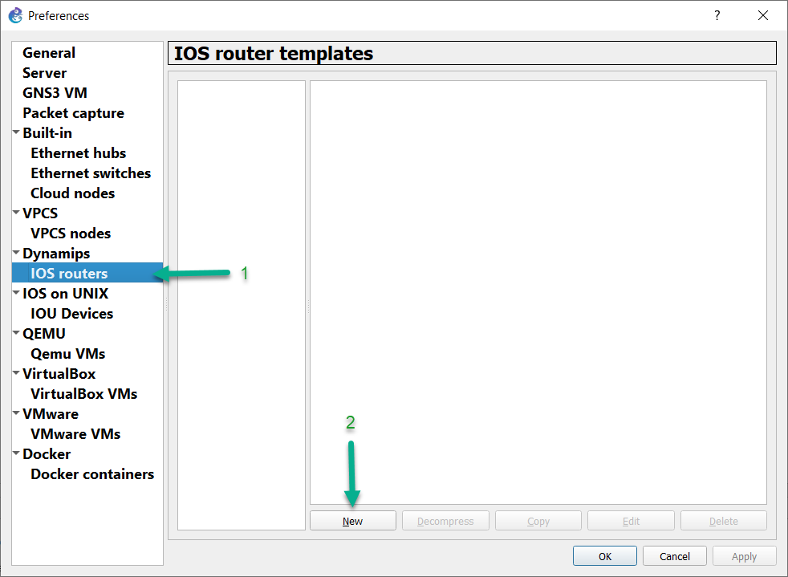

Pick **run this IOS image via the local computer**, and click **Next >**:

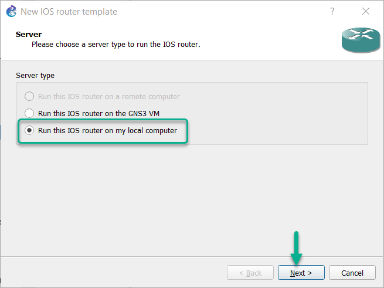

(You can also run this image via the GNS3 VM)
Select **New Image**, and click **Browse** to locate the image in your filesystem (you must supply your own!).

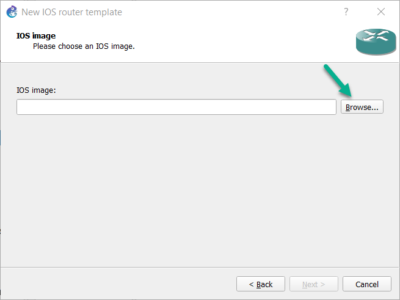

Select the image file, and click **Open**:  

You’ll be asked if you’d like to decompress this image. Choose **Yes**, as it will load faster, instead of decompressing every time you start the image:

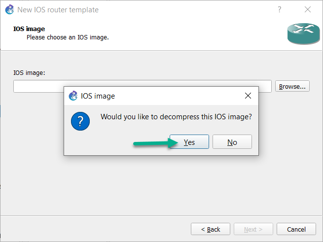

Click **Next >** to continue:

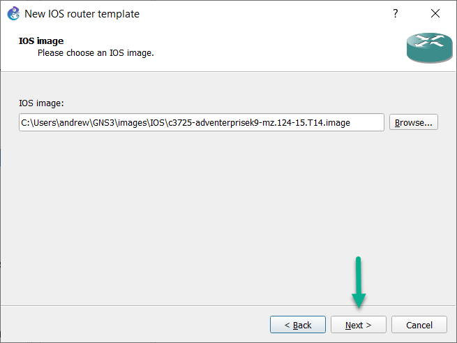

 On the screen where you’re asked to name the router, select the **“This is an Etherswitch router”** option (this is important!). It will automatically name the device **Etherswitch router**, and place into the **Switches** device category, instead of **Routers**. Click **Next >**:

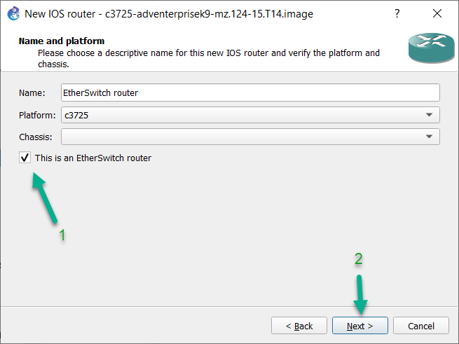

On the next screen, go ahead and increase the minimum amount of RAM to 256MB, and click **Next >**:

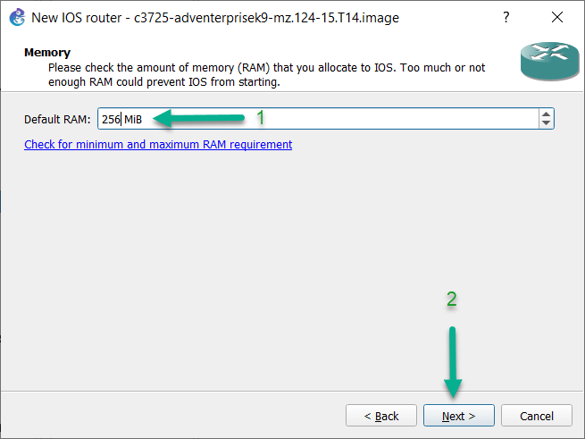

Notice that slot 0 is still prepopulated with the GT96100-FE Dual FastEthernet adapter, and slot 1 will have the NM-16ESW module preinstalled.  Never attempt to replace that GT96100-FE adapter with a switch module, as it will not work. You can add a second NM-16ESW,a NM-1FE-TX single FastEthernet adapter,  or an NM-4T serial port adapter to slot 2.

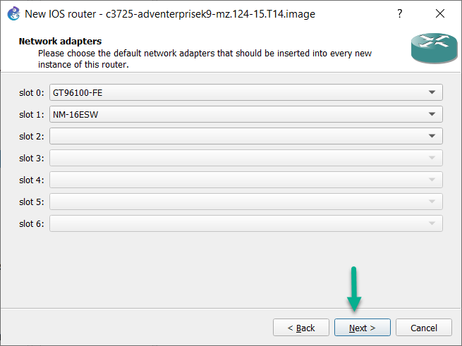

Click **Next >**:

You can add WIC modules on the next page, consisting of either WIC-1T or WIC-2T serial port adapters.  It’s not a bad idea to add a few serial WICs to this Etherswitch Router, but you can skip this step if you choose. Whichever you decide, click **Next >** to continue:.

This device will should already have an Idle-PC value listed. If so, click **Finish**:

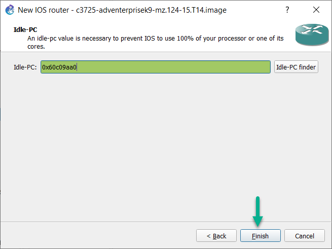

If the IOS image you are using does not also list an **Idle-PC** value, then click the **Idle-PC finder** button:

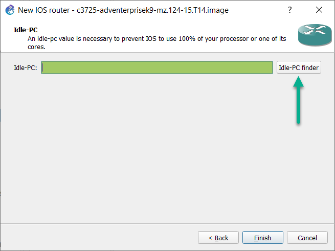

Without having a suitable Idle-PC value for this device, it can consume 100% of the processing time of a CPU core, while running.  With an Idle-PC value defined, this will not be the case.  

It will take several seconds (depending on the speed of your computer) for the **Idle-PC Finder** to determine a suitable **Idle-PC** value:

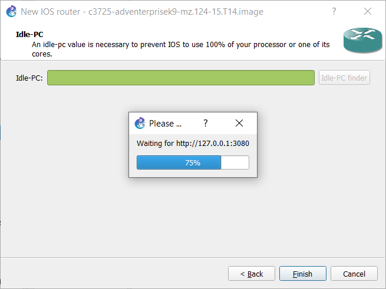

Once an Idle-PC value is found, click **OK** to close the pop up window:

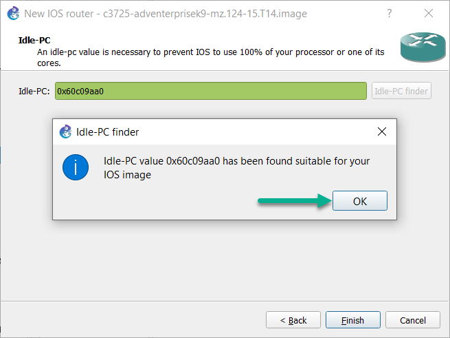

Click **Finish** to complete the import and set up process:

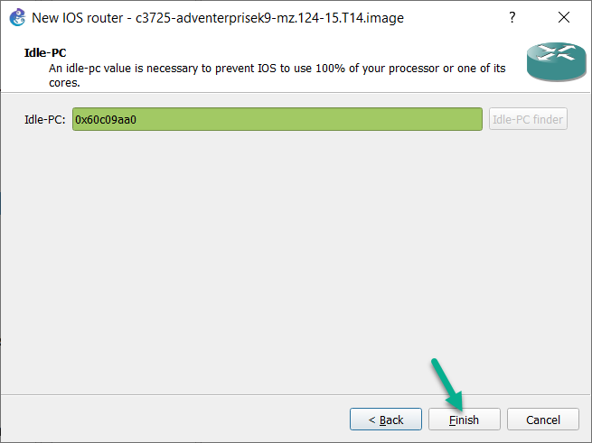

Back at the main **IOS router template** page, ensure that the Etherswitch router has at least **1MB** specified for **PCMCIA disk0**:

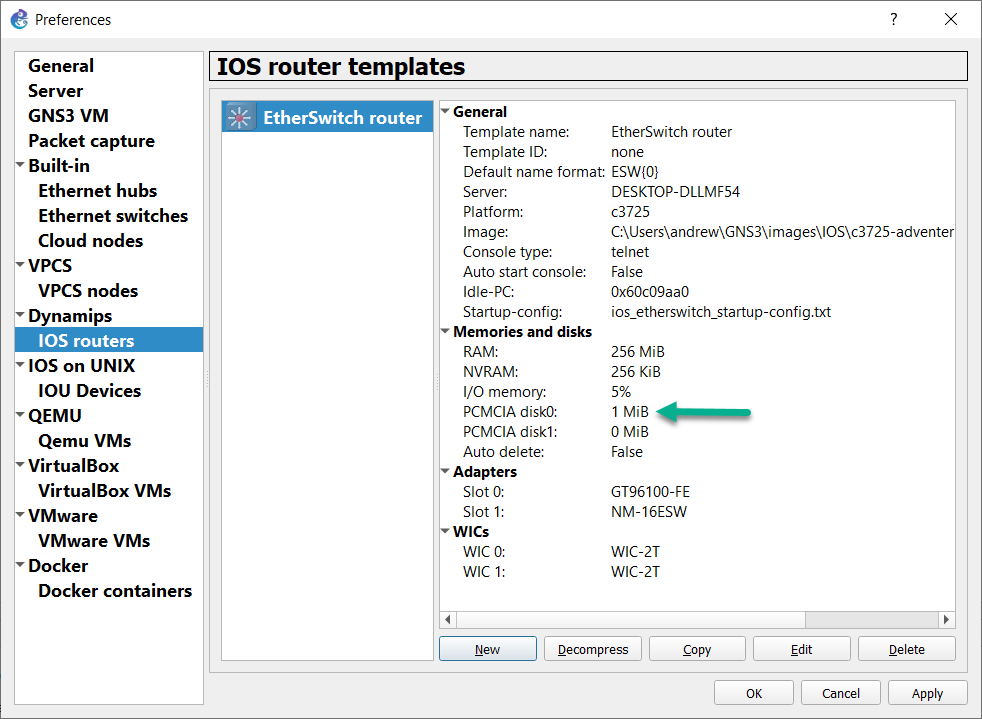

Click **OK** to return to the main GNS3 GUI:

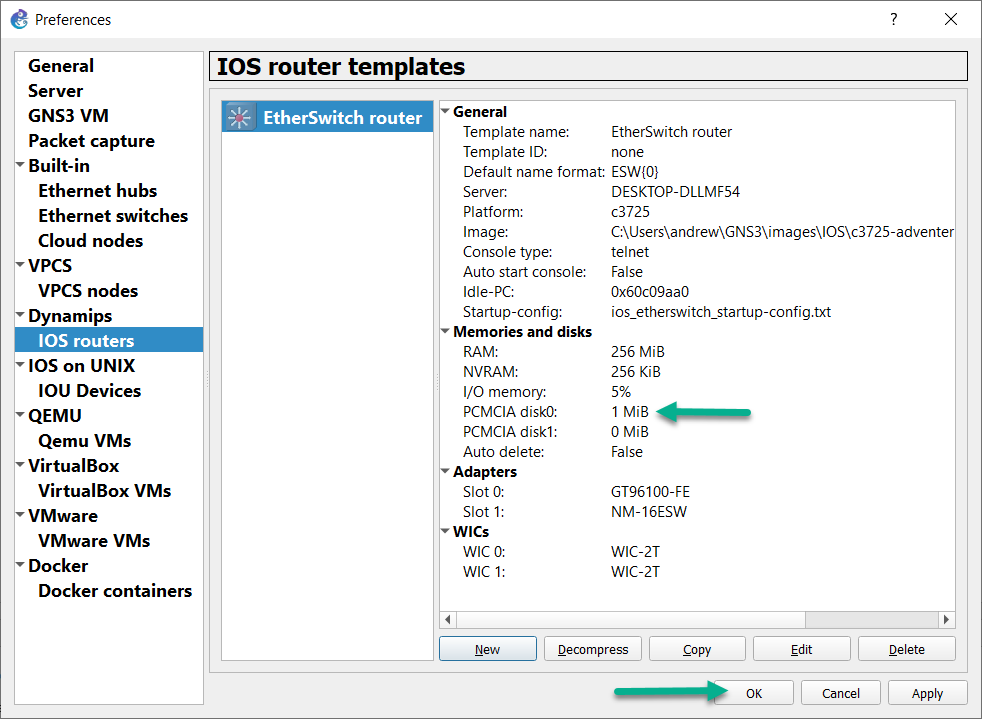

When you add this Etherswitch Router to a topology in the **Workspace**, there is something you must be aware of.  The first two FastEthernet ports (fa0/0 and fa0/1) provided by that GT96100-FE are routed ports only!  This is by design, and they cannot be used as switchports.  If you left the default NM-16ESW adapter installed in slot 1, the switchports will be interfaces fa1/0 and go through fa1/15:  

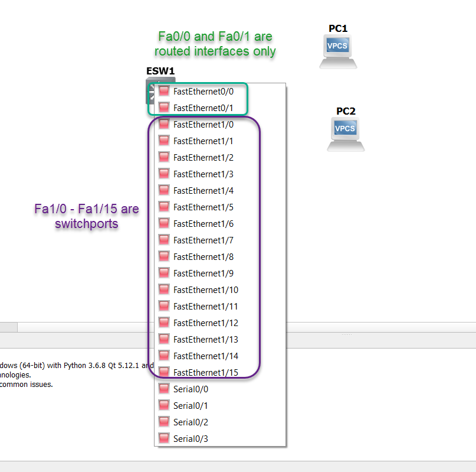

With that out of the way, let’s see a few of the configuration quirks you’ll want to be aware of.  When the Etherswitch router boots up, you’ll see that you either create vlans using “vlan database” in exec mode, or the “va [#]” macro in global config mode:

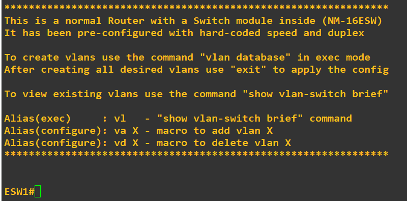

Here’s an example of creating vlans 10 and 20 in vlan database:

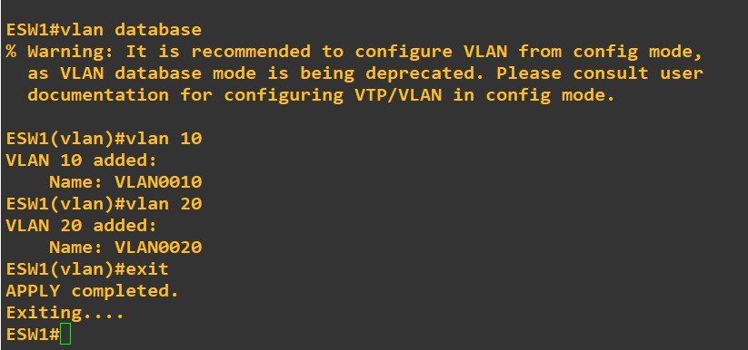

We can’t use the “sh vlan” command, but we can either use the “sh vlan-switch brief” command or the “vl” macro in exec mode:

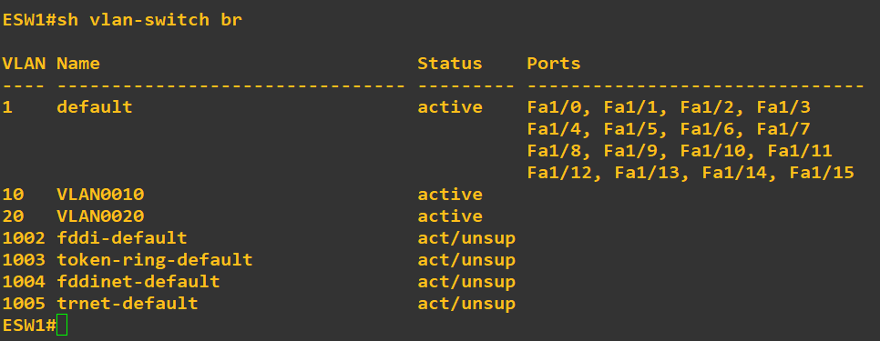

Despite the router saying to create/delete VLANs in config mode instead of vlan database, both of those macros will take you out to the vlan database, and then return you to global config mode automatically.

“va [#]” in global config mode will add a vlan:

While “vd [#]” in global config mode will delete a vlan:

These are just the immediate quirks you’ll need to get accustomed to, when using these Etherswitch routers, as opposed to the IOSvL2 multilayer switch VM from Cisco VIRL.  Again, for a full list of what these Etherswitch routers are and are not capable of, please refer to the link I posted at the beginning of this section.  

If VIRL isn’t an option, but you can use the GNS3 VM in VMware Workstation Player/Pro/Fusion, ESXi, or even running GNS3 natively in Linux, there are multiple non-Cisco vendors with switch VMs available.  Some merely require registration to download, like Arista and their vEOS switch VM,  Cumulus Networks and their Cumulus VX VM, others like Extreme Networks make their virtual EXOS and VOSS VMs available for free on Github, and Juniper does have a vQFX-10K switch VM, but you must request access from a service rep to get the 90 day trial.   Only vEOS comes close to having a CLI comparable to IOS, and obviously not every feature will be functional on these VMs, and some have steep system requirements, but they are an alternate option.
