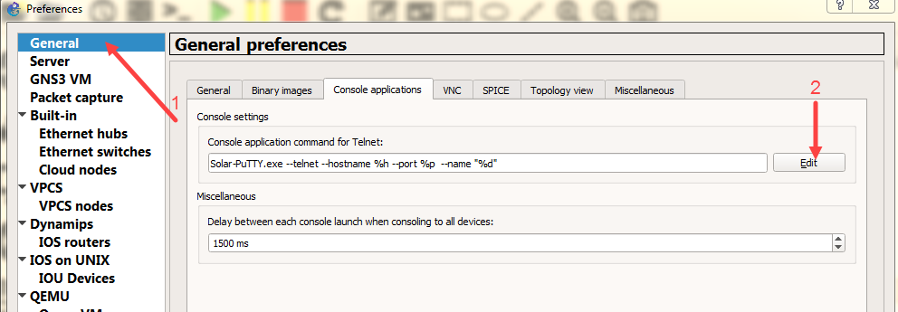
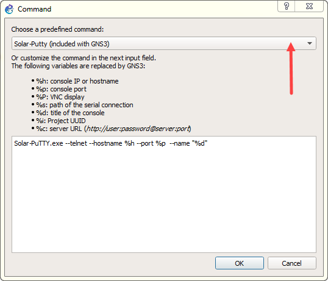
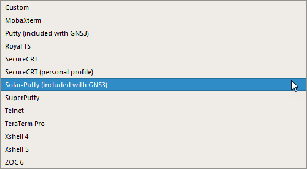
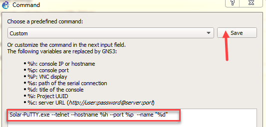
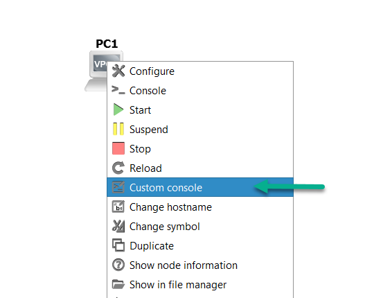

GNS3 uses Solar-PuTTY as the default console terminal in Windows* (see note), and will attempt to use the default system terminal in other operating systems (gnome-terminal, for example, in vanilla Ubuntu).  

You can direct GNS3  to use one of multiple other popular terminals (as options are provided in a handy dropdown selection menu), you can also create and save custom entries for any console applications (if needed), as well as temporarily use a custom console on a per-node basis in a project.

## Change the Terminal

In **Edit->Preferences->General preferences->Console applications**, you can edit the command used to start the console application.

And choose a predefined command

Below are the predefined commands currently included:

## Use a custom Terminal

If you choose Custom and Save, you can add a non-supported terminal to the dropdown list:

Modify the highlighted section above to include the application’s executable, along with any necessary variables required.

If the console application isn’t part of your PATH environment variable, you’ll need to include the full directory path to it. For example, you’d add “C:\Program Files\some-console-app\program.exe”, and then any necessary variables. It’s outside the scope of this document to cover editing your PATH environment variable, or cover all the possible variables available for the many console applications available.

## Use a different terminal just one at a time

If you right-click on node in a topology you can open a different terminal than the default.

Now that Solar-Putty is the default, David Bombal has created some videos on how you can customize it to your liking:

- Video: https://www.youtube.com/watch?v=mQKbXMIxHSk
- Video: https://www.youtube.com/watch?v=Q2TnxcJa0wI
- Video: https://www.youtube.com/watch?v=shoDldraAsE

:::note
Solar PuTTY is only included by default, if you download the GNS3 AIO installer for Windows from gns3.com directly. If you downloaded that installer from, say, github, then vanilla PuTTY will be the default terminal emulator used, instead.

You can still download Solar-PuTTY from SolarWinds (it’s free), copy/paste the Solar-PuTTY executable to the main GNS3 installation folder, and then direct GNS3 to use it as the default console application, by editing the preferences (as shown above).
:::
