Starting with GNS3 2.0,  the NAT node became available. This node allows you to connect a topology to internet via NAT. The Internet node was deprecated in favor of this node, and the Cloud node.

:::note
Your topology will not be directly accessible from the internet or local LAN, when using the NAT node. If that is required, then the Cloud node should be used.
:::

It’s useful when you need to download things from the internet, like packages, if nodes need to perform license check, etc…). It’s also much simpler to use than the preexisting Cloud node.

The NAT node requires either the GNS3 VM,  or a Linux computer with libvirt installed. Libvirt is necessary, to create a virbr0 interface for this node to function.

By default, the NAT node runs a DHCP server with a predefined pool in the 192.168.122.0/24 range. It’s located in the End devices category:

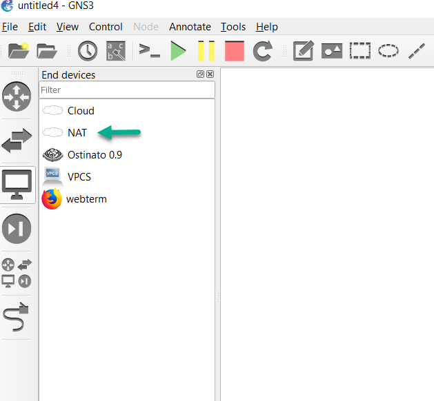

To add the NAT node to a topology, drag and drop it into the workspace. You will be prompted to specify the server type you want to use, to run the NAT node. This article will use the Webterm docker container for testing internet connectivity, so the server type needs to be set to GNS3 VM, as this is being done on a Win10 workstation:

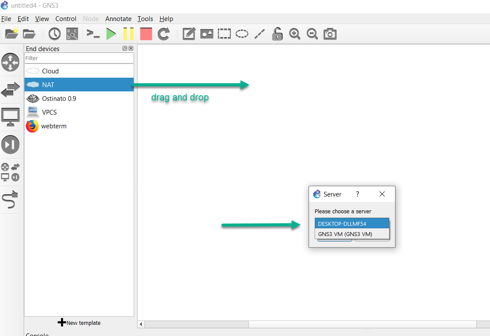

The NAT node will appear in the workspace:

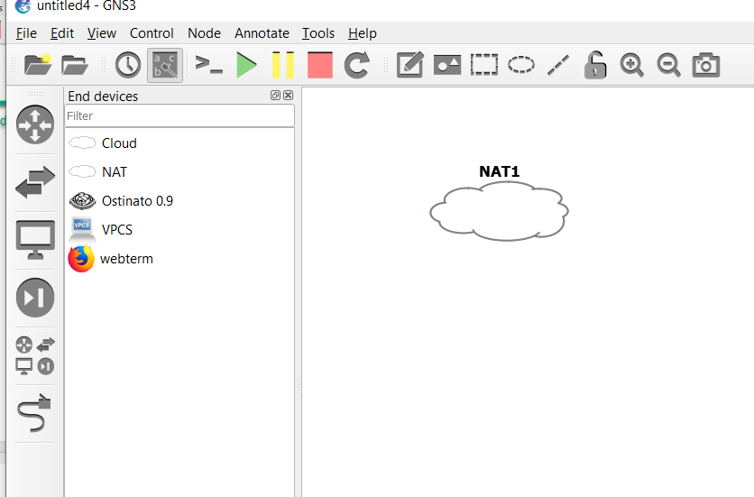

Next, the Webterm docker container will also be added to the workspace:

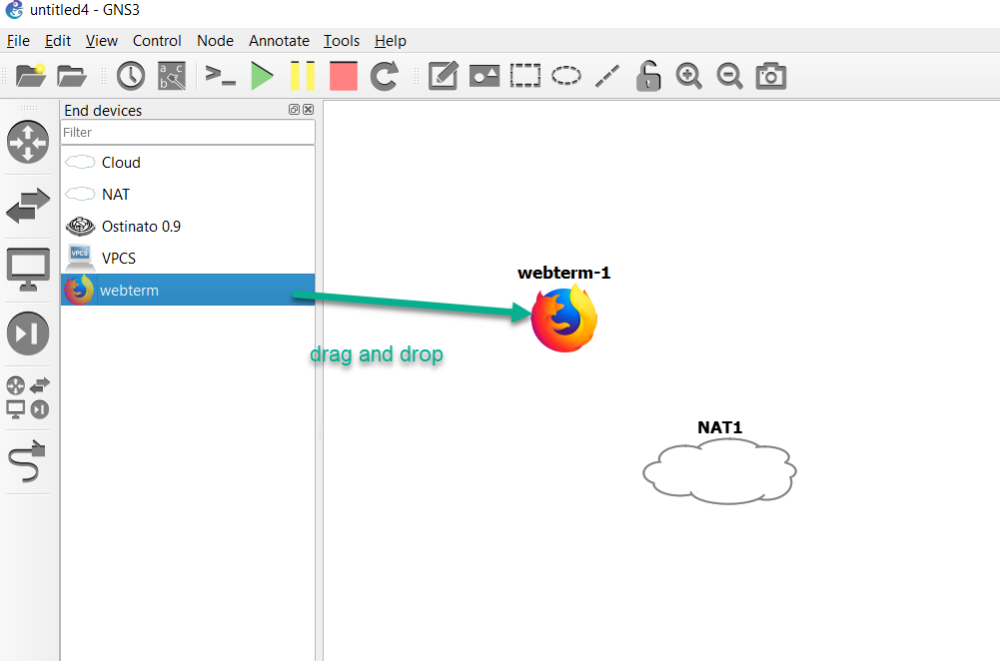

The NAT node has a single interface named nat0:

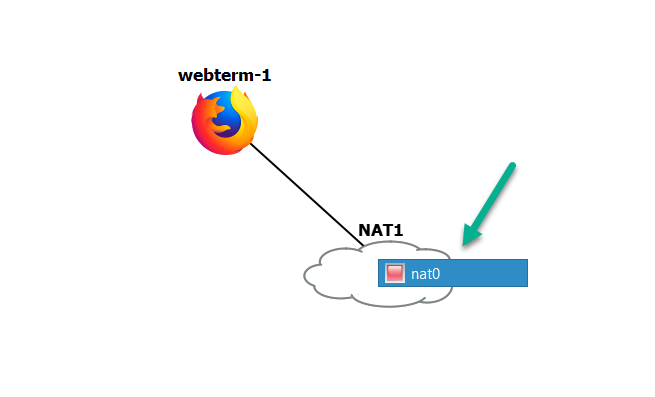

To allow more than one topology node to have access to the internet, it will be necessary to connect a switch or router to the NAT node,  and then connect the topology nodes to the other device.

For simplicity, the built-in ethernet switch will be connected to the NAT node, and the Webterm container will be connected to the switch:

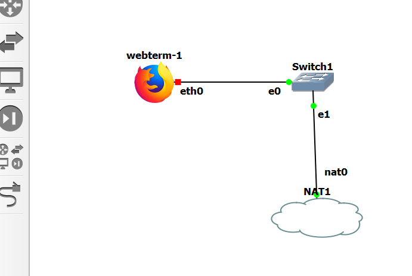

You enable DHCP or manually configure static IP assignment to docker container like Webterm, by right-clicking on it while it’s shutdown, and then select “Edit config”:

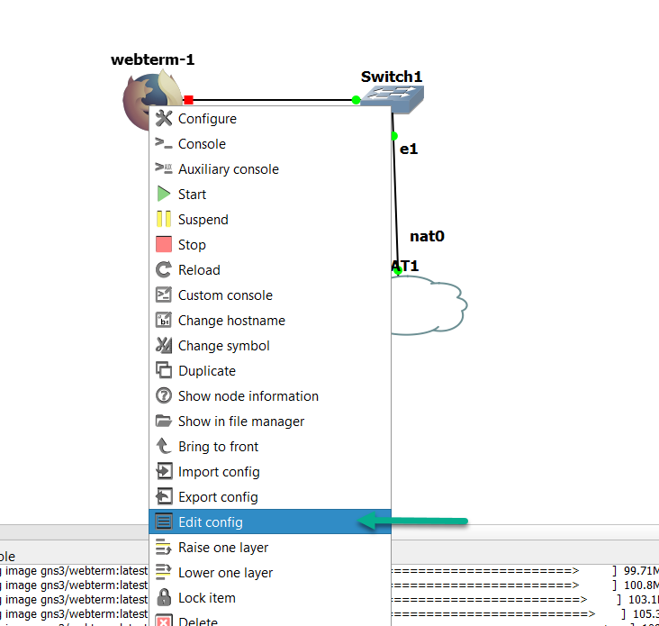

A window will open, showing this container’s /etc/network/interfaces file:

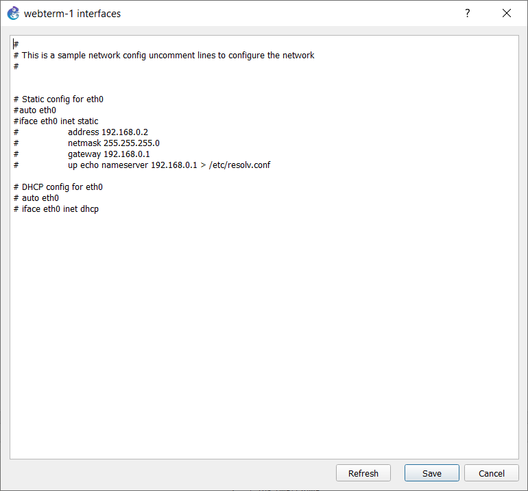

To configure this container to use DHCP, you uncomment the two lines shown in the below image, and click Save:

(uncomment means removing the ‘#’ symbol at the front of those lines. That symbol causes the system to not read those lines, and are commonly used to add comments to code, which should not be processed)

Starting up the Webterm container (the NAT node will automatically be running from the moment it’s added to a topology) and opening its console will result in a VNC window appearing.  Click on the “Restore” symbol in the upper-right corner of Firefox, to take it out of the fullscreen view:

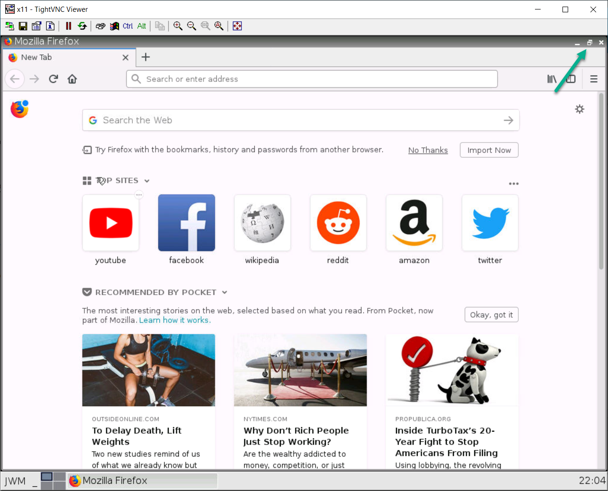

Left-clicking on the black background and selecting “Terminal” will open terminal window:

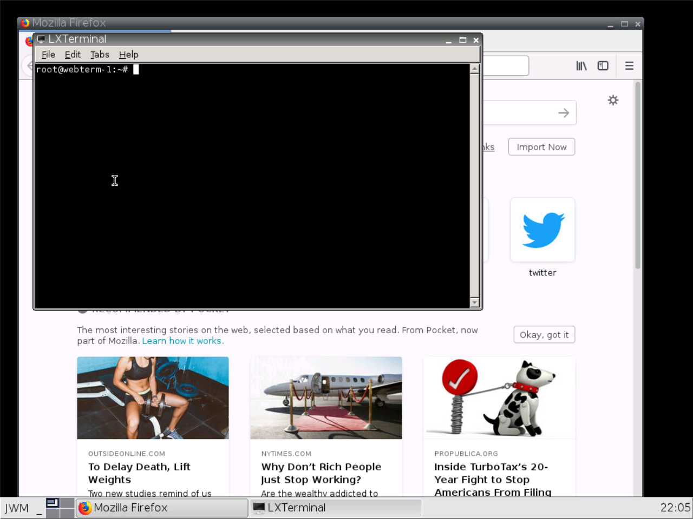

You can use the terminal for a variety of things, but in this article, it’ll just be used to check the IP configuration of the container.

Using the ‘ifconfig’ command in the terminal will show that the DHCP running on the NAT node assigned this container the 192.168.122.200 address from its pool:

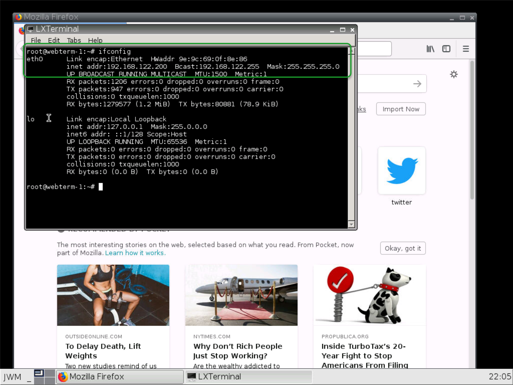

Back in Firefox, enter a URL in the address bar, to access a website:

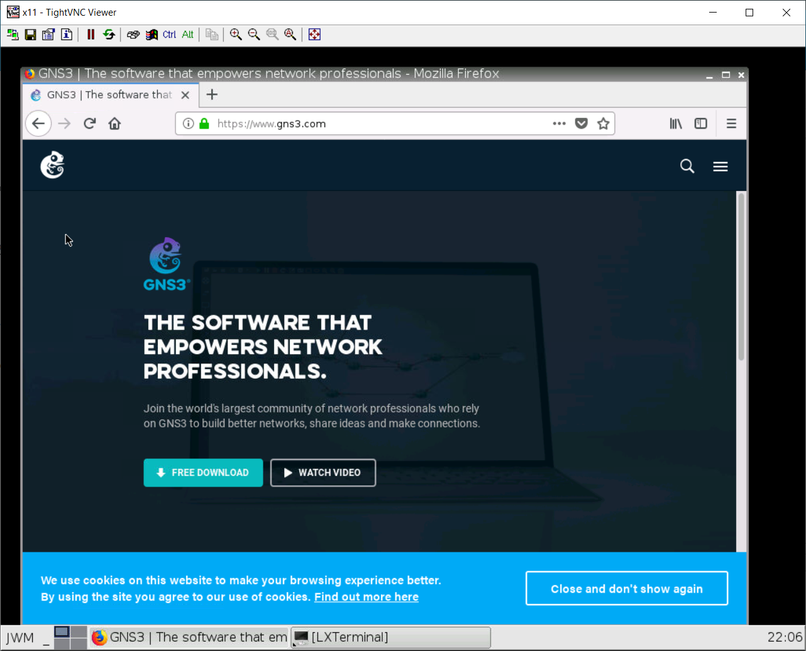

You aren’t restricted to just using dynamic address assignment with the NAT node. You can also statically assign IP addressing on it, and still have internet access.

Stop the Webterm container, right-click it, and choose “Edit config” again.  

This time, you’ll comment out the two lines for DHCP, and uncomment the lines in the Static IP section of the /etc/network/interfaces file;

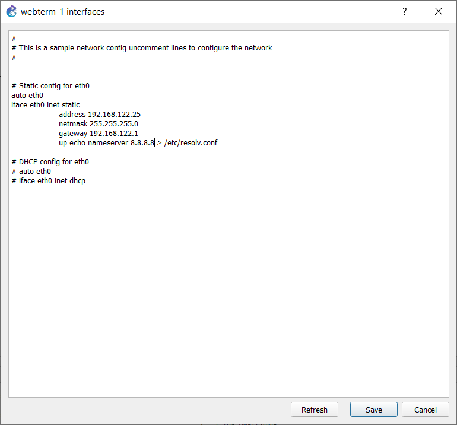

In the above example, the Webterm container was statically assigned the 192.168.122.25/24 IP address and mask, its default gateway was set to 192.168.122.1 (the internal IP address of the NAT node), and the nameserver was set to 8.8.8.8, which is one of Google’s free public DNS servers.

Click Save, start the container, and console back into it.  Opening a terminal and running “ifconfig” will show that the container is using the statically assigned IP address:

Entering a URL in the Firefox address bar will open a website:

